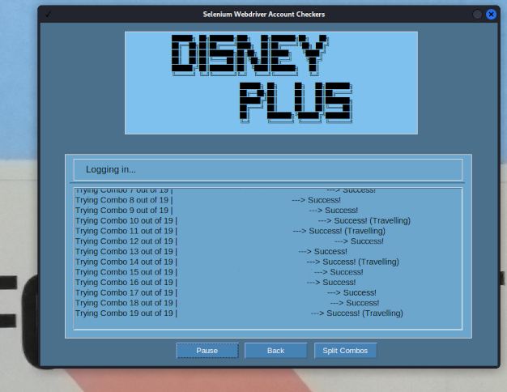

# Selenium Account Checker GUI
## A graphical Interface to check Account Combos

Will check account combos by opening headless Selenium, and iterating through a list of usernames and passwords.

Choose which service to check by pressing the appropriate button. There is also the ability to change and store colour-scheme for the entire GUI, so that a colour which is deemed more appropriate for reading can be selected.

The first working version can only check one service, although buttons for all services have been added. Modules already exist for all services but they will have to be ported and adapted to the GUI.

Minor bugs exist but it is fully functional for the service it checks.
